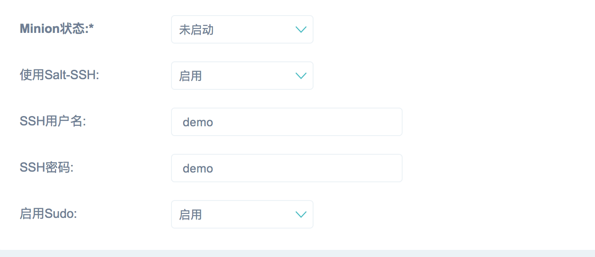

#使用SaltSSH

当没办法或者不想安装SaltMinion的时候，我们可以使用SaltSSH，首先需要在master节点
上安装Salt-SSH

```
apt-get install salt-ssh
```

Salt-SSH在第一次接收客户端的时候，会问我们要不要把密钥加入到信任列表中，所以我们可以编辑
`/etc/ssh/ssh_config`，加入如下配置

```
Host 192.168.80.*
   StrictHostKeyChecking no
   UserKnownHostsFile=/dev/null
```

配置完成后，在主机列表中新增一条记录


填写密码等必要信息


SaltOps会在自动扫描并完善该主机的信息