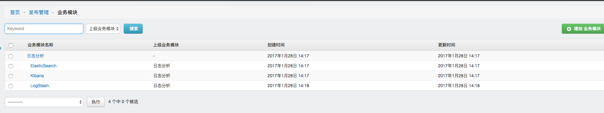
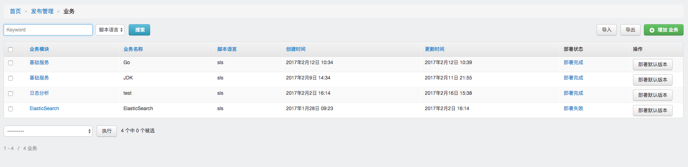
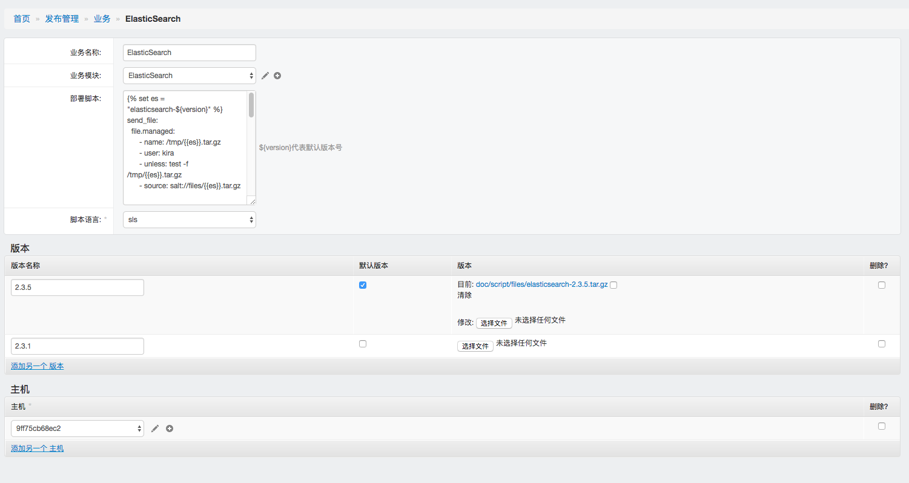
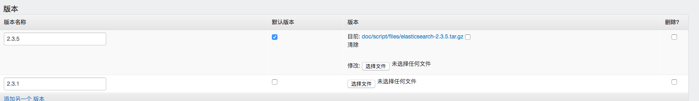
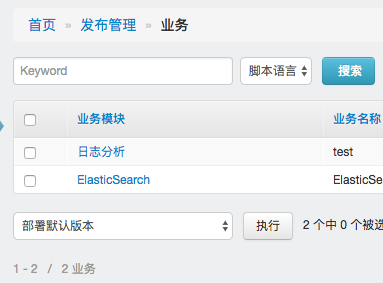
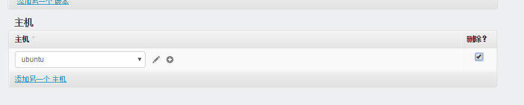
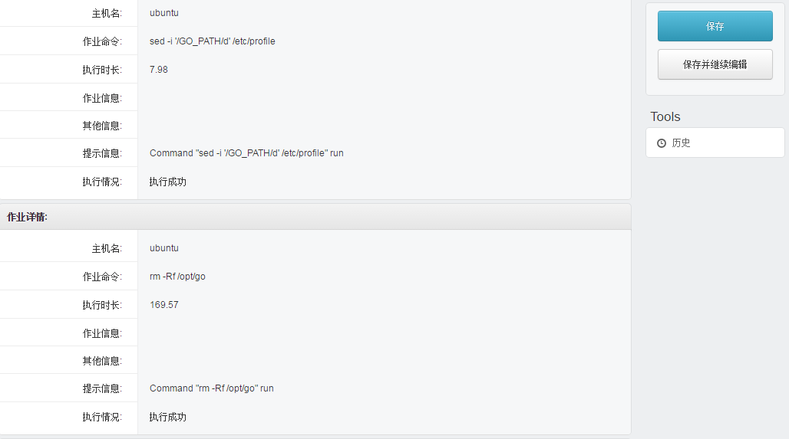
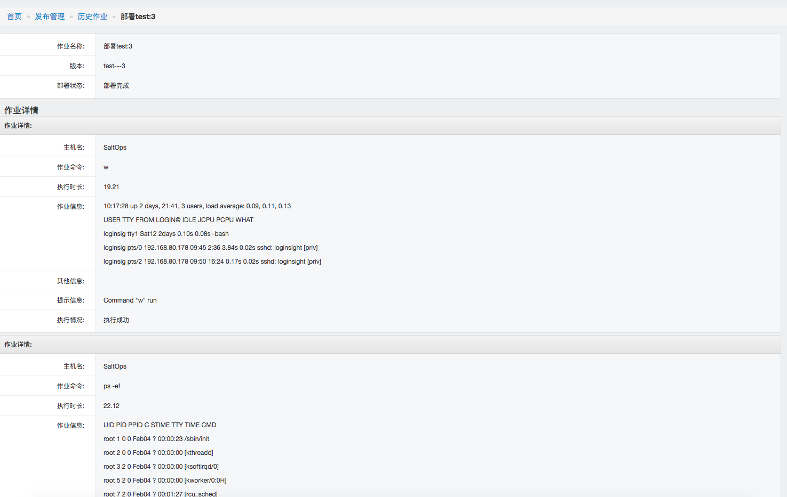

发布管理模块用于发布软件包，发布管理支持以下种模式对软件包进行发布安装
- SLS:直接编写sls模板进行软件包的发布安装
- Script：通过Salt把脚本传送下去，然后在客户机上执行对应的脚本

#业务模块

业务模块的设计为树状结构，一个业务模块下可以有多个业务模块。业务模块主要用于为业务分类使用

#业务

每个业务都有自己对应的版本以及部署脚本，列表中的部署状态指的是最后一次的部署状态

需要自己编写业务的部署脚本，部署脚本中会有一些系统自带的变量，方便不同版本之间的部署，使用sls文件更是可以使用jinja语法来进行模板的编写

一个业务里面会有多个版本，和CI中持续发布的版本不一样，这里的版本是正式发布的版本，每个版本都存下来，需要回滚只需要把默认版本选择一下，就可以回滚回去了。

主机的面板用于把业务和主机关联起来，在部署的时候系统根据选中的主机进行业务的部署

操作完成后，点击部署默认版本，就会开始执行部署脚本了

#业务卸载

当一个关联到业务的主机从列表业务中被删除并且有编写卸载脚本的时候，系统会自动触发业务卸载动作，把
业务从对应的主机中卸载

#历史作业

在历史作业里面，可以看到每次部署的情况还有最终执行的结果，执行的时长

