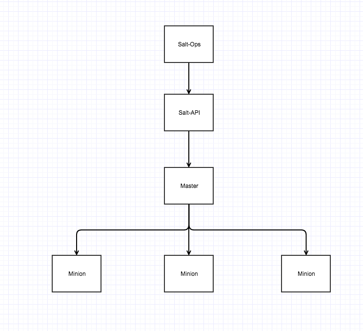
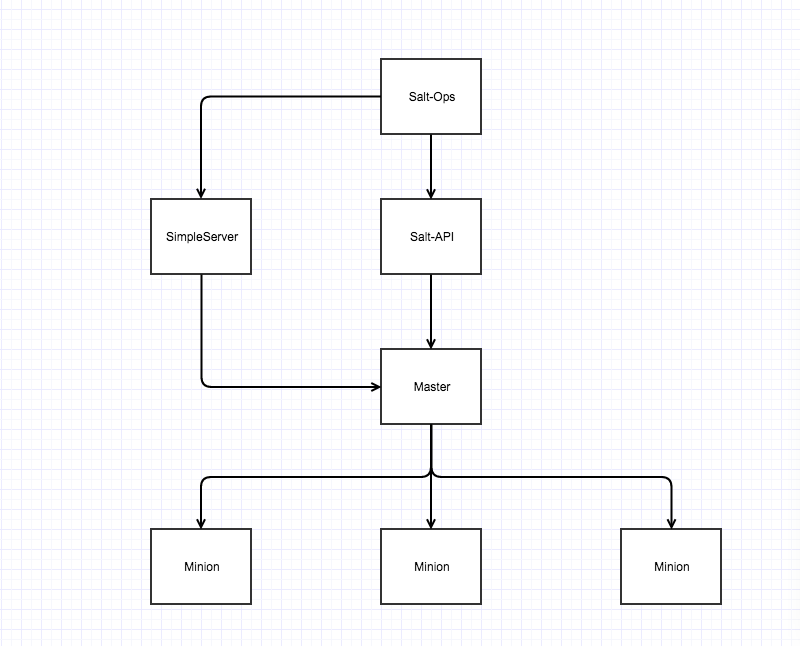

# 集中部署

集中部署模式下，Salt-API、Salt-Master、SaltOps部署在同一节点上，采用root类型的fileserver_backend

# 分离部署

集中部署模式下，Salt-API、Salt-Master部署在同一节点上、SimpleService、SaltOps部署在同一节点上，采用root类型的fileserver_backend(当然也可以用git的。。这个自己选啦)

