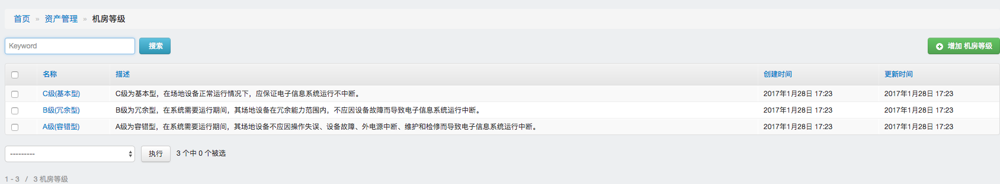
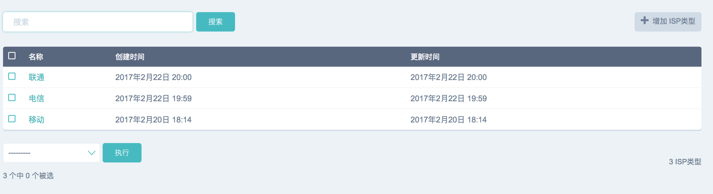
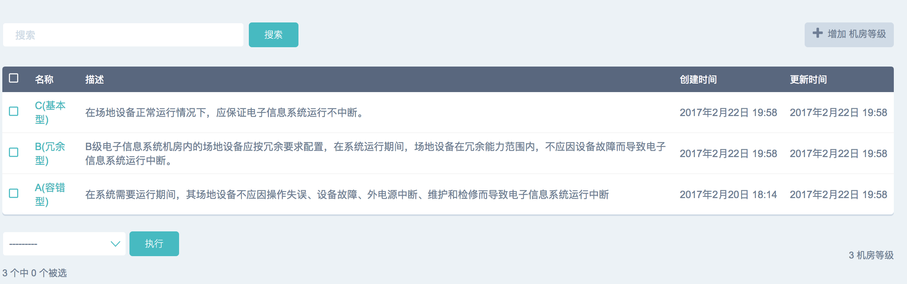
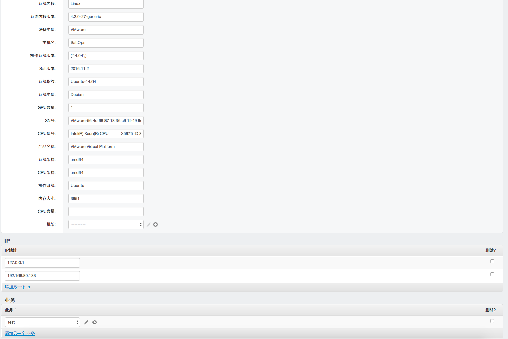

#机房等级

每个机房都应该有自己的等级，用来标记机房的重要程度

#ISP

记录一下线路信息

#机房

一个机房对多个机柜，一个机柜对多个机架，基础信息都可以在这里一次填好

#机柜&机架

其实这两个菜单藏起来也可以的样子。。该填的信息通过机房这个菜单就可以一次全部填完了

#主机

系统有定时任务，会自动的把主机的信息都收集回来，然后把IP、系统名称等基础信息填上，这里一般是不用手动维护的。给客户机装上Salt就好了

> 这里应该要支持多种模式才方便，也可以通过手动录入，选择SSH模式，然后走SSH采集不装Agent

